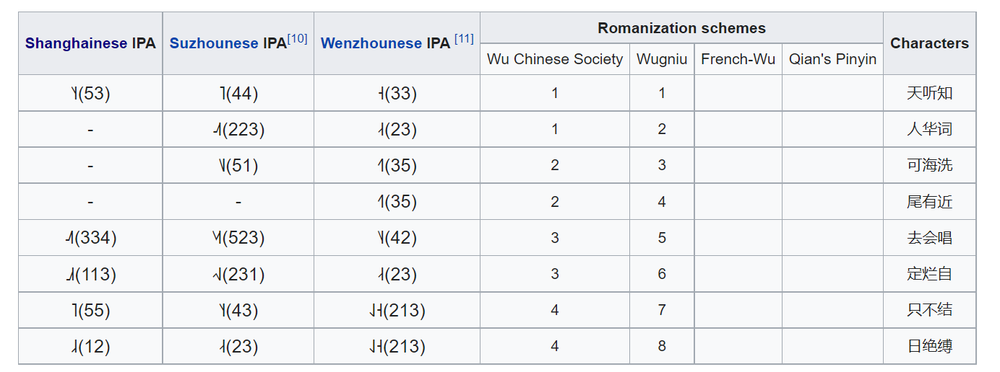

# shanghainese

## goals

- [x] concise
- [x] reversible
- [x] phonetic-leaning (opposed to **phonemic**)
- [ ] ascii-compatible
- [ ] intuitive

## writing

| initials | lb  | alv | pl  | vl  | gl  |
| -------- | --- | --- | --- | --- | --- |
| ns       | m   | n   | ny  | ng  |     |
| pl       | p   | t   |     | k   | ‘   |
| pl +asp  | ph  | th  |     | kh  |     |
| pl +vc   | b   | d   |     | g   |     |
| af       |     | z   | j   |     |     |
| af +asp  |     | c   | q   |     |     |
| af +vc   |     |     | dj  |     |     |
| fr       | f   | s   | sz  |     | h   |
| fr +vc   | v   | z   | zs  |     | gh  |
| lt       |     | l   |     |     |     |

- pre-glottalised initials add a _h_ after the letter. thus, /ˀȵ/ is **_nyh_**.

| finals | ◯   | j◯        | w◯      | ◌̃   | j◌̃        | w◌̃        | ◯ʔ  | j◯ʔ       | w◯ʔ       |
| ------ | --- | --------- | ------- | --- | --------- | --------- | --- | --------- | --------- |
| a      | a   | ya / ia   | wa / ua | an  | yan / iân | wan / uan | a’  | ya’ / ia’ | wa’ / ua’ |
| ɑ      |     |           |         | ân  | yân / iân | wân / uân |     |           |           |
| e      | e   |           | we / ue |     |           |           |     |           |           |
| ɛ      | ê   | yê / iê   | wê / uê |     |           |           |     |           |           |
| ə      |     |           |         | ën  |           | wën / uën | ë’  |           | wë’ / uë’ |
| ɤ      | oe  | yoe / ioe |         |     |           |           |     |           |           |
| o      | ô   |           |         |     |           |           |     |           |           |
| ɔ      | o   | yo / io   |         |     |           |           |     |           |           |
| ø      | ö   | yö / iö   | wö / uö |     |           |           |     |           |           |
| i      | i   |           |         | in  |           |           | i’  |           |           |
| u      | u   |           |         | un  | yun / iun |           | u’  | yu’ / iu’ |           |
| y      | ü   |           |         | ün  |           |           | ü’  |           |           |

the second in each pair is to be written when a non-glide initial is present.

tones follow the **wugniu** romanisation scheme.

